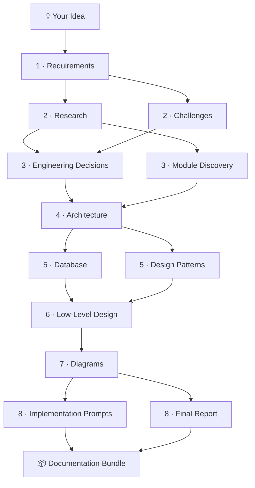

<div align="center">

<h1>🏛️ Architecture Copilot</h1>

<h3><em>From ideas to real architecture.</em></h3>

<p>
  A multi-agent AI copilot that turns a one-line project idea into a complete,
  buildable software design — requirements, engineering decisions, architecture,
  diagrams, and ready-to-paste implementation prompts.
</p>

<p>
  
  
  
  
  
  
  
  
</p>

</div>

<hr />

<h2>📖 Overview</h2>

<p>
  <b>Architecture Copilot</b> takes a single project idea and walks it all the way
  to a production-ready architecture. Twelve specialized AI agents collaborate in a
  step-by-step pipeline — each one building on the work of the last. It is
  <b>human-in-the-loop by design</b>: you review every stage, give feedback, rerun if
  needed, and advance only when you're satisfied.
</p>

<p>
  The output isn't just diagrams — it's engineering-ready requirements, justified tech
  decisions, ER schemas, Mermaid/PlantUML diagrams, low-level design, ready-to-paste
  Claude implementation prompts, and a downloadable documentation pack to build from.
</p>

<hr />

<h2>✨ Features</h2>

<ul>
  <li>🧠 <b>12 specialized agents</b> orchestrated across 8 pipeline stages</li>
  <li>🔍 <b>Web-search-backed research</b> for up-to-date frameworks and approaches</li>
  <li>🪜 <b>Step-by-step, human-in-the-loop flow</b> — review, give feedback, and rerun any step</li>
  <li>🗂️ <b>Rich artifacts</b> — requirements, decisions, architecture, ER schema, design patterns, LLD</li>
  <li>📊 <b>Auto-generated diagrams</b> in Mermaid and PlantUML (sequence, class, component, request flow)</li>
  <li>🤖 <b>Implementation prompts</b> you can paste straight into your editor to start building</li>
  <li>📦 <b>One-click export</b> of the full design as a Markdown documentation bundle</li>
</ul>

<hr />

<h2>⚙️ How It Works</h2>

<p>You describe what you want to build in a sentence; the pipeline researches, decides, and designs the rest.</p>



<table>
  <thead>
    <tr><th>Stage</th><th>Agent</th><th>What it produces</th></tr>
  </thead>
  <tbody>
    <tr><td>1</td><td><b>Requirements</b></td><td>Functional &amp; non-functional requirements, assumptions, open questions</td></tr>
    <tr><td>2</td><td><b>Research</b></td><td>Web-searched deep dive on frameworks and approaches</td></tr>
    <tr><td>2</td><td><b>Challenges</b></td><td>Risks, obstacles, and edge cases surfaced up front</td></tr>
    <tr><td>3</td><td><b>Engineering Decisions</b></td><td>Tech-stack choices with rationale and trade-offs</td></tr>
    <tr><td>3</td><td><b>Module Discovery</b></td><td>The system's logical modules and boundaries</td></tr>
    <tr><td>4</td><td><b>Architecture</b></td><td>High-level design: layers, request flow, cross-cutting concerns</td></tr>
    <tr><td>5</td><td><b>Database</b></td><td>ER diagrams and schema design</td></tr>
    <tr><td>5</td><td><b>Design Patterns</b></td><td>Patterns matched to the problem</td></tr>
    <tr><td>6</td><td><b>Low-Level Design</b></td><td>Packages, DTOs, services, and controllers</td></tr>
    <tr><td>7</td><td><b>Diagrams</b></td><td>Sequence, class, component &amp; request-flow diagrams (Mermaid + PlantUML)</td></tr>
    <tr><td>8</td><td><b>Implementation Prompts</b></td><td>Ready-to-paste Claude prompts to start building</td></tr>
    <tr><td>8</td><td><b>Report</b></td><td>Stakeholder-friendly summary of the whole design</td></tr>
  </tbody>
</table>

<hr />

<h2>🧱 Tech Stack</h2>

<table>
  <tr><td><b>Backend</b></td><td>Java 17+, Spring Boot 3, Spring AI, Maven</td></tr>
  <tr><td><b>AI</b></td><td>Claude (Anthropic) · optional local models via Ollama</td></tr>
  <tr><td><b>Frontend</b></td><td>React 18, TypeScript, Vite</td></tr>
  <tr><td><b>Diagrams</b></td><td>Mermaid, PlantUML</td></tr>
</table>

<hr />

<h2>🚀 Getting Started</h2>

<h3>Prerequisites</h3>
<ul>
  <li>Java 17+ and Maven</li>
  <li>Node.js 18+ and npm</li>
  <li>An Anthropic API key</li>
</ul>

<h3>1 · Configure</h3>

<p>Set your API key (via environment variable or <code>src/main/resources/application.yaml</code>):</p>

```bash
export ANTHROPIC_API_KEY="sk-ant-..."
```

<h3>2 · Run the backend</h3>

```bash
mvn spring-boot:run
```

<h3>3 · Run the frontend</h3>

```bash
cd frontend
npm install
npm run dev
```

<p>Then open the URL printed by Vite (default <code>http://localhost:5173</code>) and describe your project idea.</p>

<hr />

<h2>📂 Project Structure</h2>

```text
.
├── src/main/java/com/webSearch/
│   ├── agent/              # The 12 specialized AI agents
│   ├── orchestration/      # Pipeline orchestrator
│   ├── controller/         # REST API endpoints
│   ├── service/            # Design session services
│   ├── tools/              # Web search & supporting tools
│   └── config/             # Model & app configuration
├── src/main/resources/
│   └── application.yaml     # Backend configuration
└── frontend/                # React + Vite UI
    └── src/
        ├── pages/           # Design workspace
        ├── components/      # Pipeline progress, artifact tabs
        └── hooks/           # Design session state
```

<hr />

<h2>🗺️ Roadmap</h2>

<ul>
  <li>✅ Phase 1 — Core multi-agent pipeline &amp; interactive UI</li>
  <li>🔜 Phase 2 — <em>(planned)</em></li>
  <li>🔜 Phase 3 — <em>(planned)</em></li>
</ul>

<hr />

<h2>📄 License</h2>

<div align="center">
  <sub>Built with Spring AI &amp; Claude · From ideas to real architecture.</sub>
</div>
